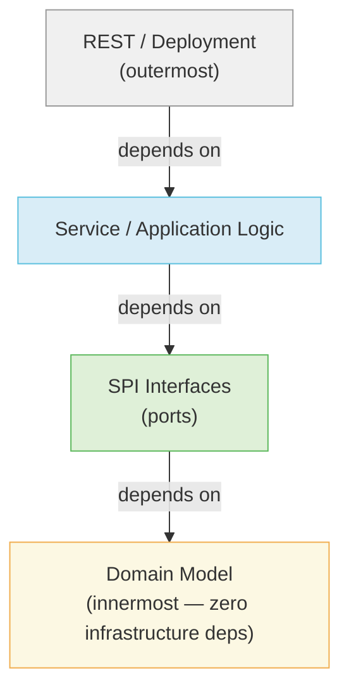
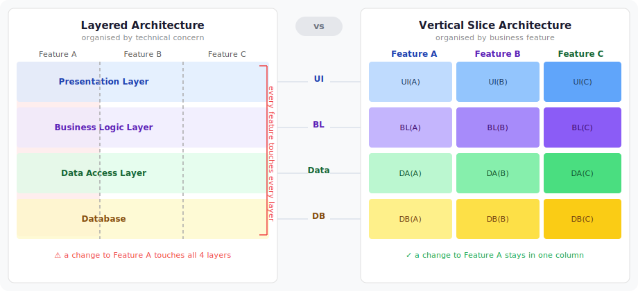
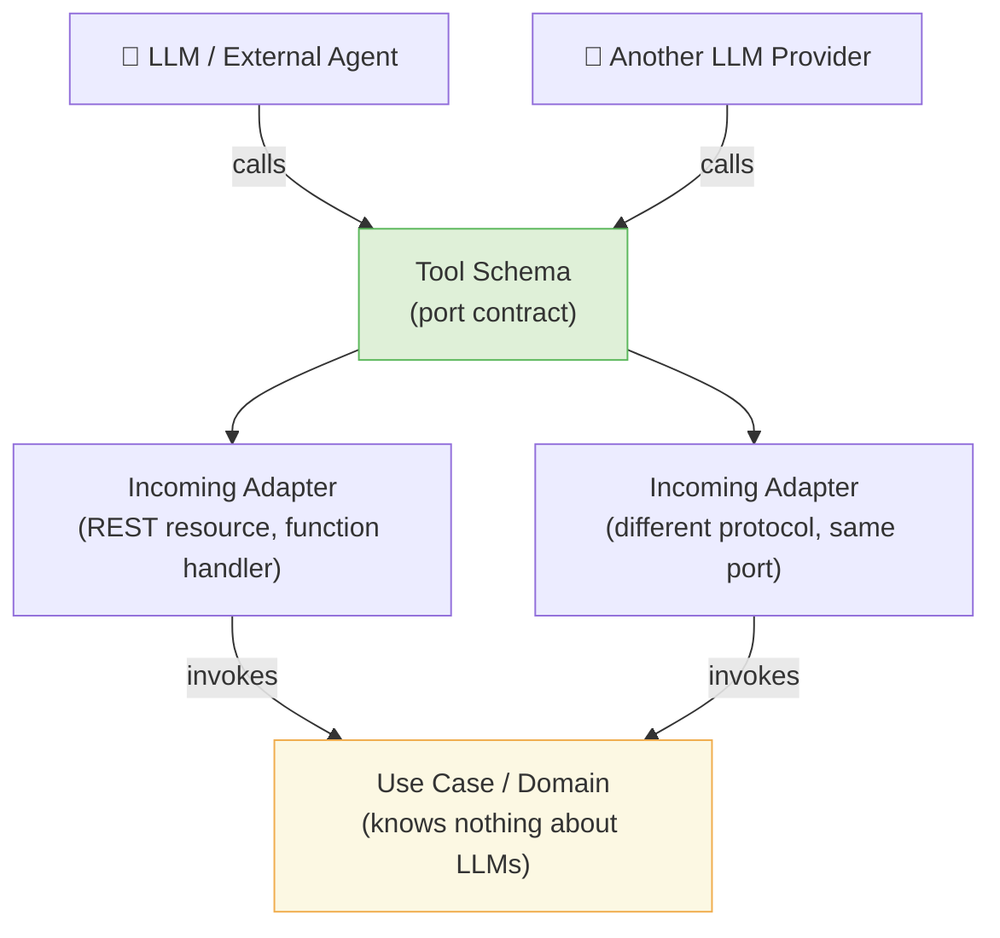

Working with LLMs on small, isolated tasks is straightforward. Working with them on a production platform — multiple repos, evolving domain, long-lived codebase — is a different problem. The difference is scale, and scale requires discipline.

The discipline is spec-driven development: you define the contract first, the LLM implements to it. But that only works if the contracts are grounded in something. Architectural patterns are that something. They give you the vocabulary to write specs that are bounded, verifiable, and composable. Without them, a spec is just a description. With them, it's a contract the LLM can actually hold.

The conventional wisdom is that LLMs lower the cost of writing code, so the cost of bad structure matters less. I think that's backwards. Bad architecture doesn't disappear when LLMs are involved — it compounds. An LLM without clear boundaries makes locally reasonable decisions that violate global constraints: persistence logic in the wrong layer, parallel implementations of existing abstractions, dependency boundaries crossed without knowing they were there. Architecture isn't overhead anymore. It's the constraint system your LLM operates within.

---

## The Pattern Landscape

Before the LLM argument, the patterns themselves deserve a working map — not a textbook, but enough to orient.

### Origins at a Glance

| Pattern | Author | Year | Core metaphor |
|---------|--------|------|---------------|
| [Hexagonal (Ports & Adapters)](https://en.wikipedia.org/wiki/Hexagonal_architecture_(software)) | Alistair Cockburn | 2005 | Hexagon cell with ports on each face |
| [Onion Architecture](https://jeffreypalermo.com/2008/07/the-onion-architecture-part-1/) | Jeffrey Palermo | 2008 | Concentric rings, domain at centre |
| [Clean Architecture](https://blog.cleancoder.com/uncle-bob/2012/08/13/the-clean-architecture.html) | Robert C. Martin | 2012 | Concentric rings, entities innermost |
| [DDD](https://martinfowler.com/bliki/DomainDrivenDesign.html) | Eric Evans | 2003 | Ubiquitous language, bounded contexts |
| [CQRS](https://martinfowler.com/bliki/CQRS.html) | Greg Young | ~2010 | Separate read/write models |
| [Vertical Slices](https://www.jimmybogard.com/vertical-slice-architecture/) | Jimmy Bogard | ~2018 | Features as vertical cuts through layers |

### What They All Share

All of them arrived at the same dependency rule: **source code dependencies can only point inward**. Outer layers (REST, database adapters) depend on inner layers (domain, SPIs). Inner layers depend on nothing outside themselves.



### Where They Differ

Hexagonal focuses on the **port/adapter boundary** — what is a driving adapter (inbound, tells the app to do something) vs a driven adapter (outbound, told by the app to do something). Onion and Clean add **explicit inner rings** — use cases sit between the domain and the adapters. DDD enriches the domain ring with aggregates, domain events, and bounded contexts. CQRS splits the data path. Vertical slices reorganise the whole thing around features rather than concerns.

| Pattern | Focus | Key invariant |
|---------|-------|---------------|
| Hexagonal | Port/adapter boundary | Domain unaware of infrastructure |
| Clean | Dependency direction | Dependencies only point inward |
| Onion | Domain ring richness | Domain model at centre, layers outward |
| DDD | Language and context | Ubiquitous language within bounded contexts |
| CQRS | Read/write separation | Commands change state; queries never do |
| Vertical Slices | Feature cohesion | Change is confined to one slice |

---

## Layered vs. Vertical Slices — The Organising Tension

This is the sharpest structural choice. Layered architecture organises by technical concern — all controllers together, all services together, all repositories together. Vertical slices organise by feature — everything needed for Feature A lives together.



| Dimension | Layered | Vertical Slices |
|-----------|---------|-----------------|
| Organised by | Technical concern | Business feature |
| Adding a feature | Touches many layers | Confined to one slice |
| Cohesion | Low — related code spread across layers | High — feature code lives together |
| Abstractions | Many (repos, services, controllers) | Minimal |
| Best for | Long-lived, domain-stable systems | Rapid, feature-driven delivery |

The honest summary from the field: *"A layered architecture organises for plumbing. A vertical slice organises for change."* Neither is always right.

---

## Blended Approaches

Pure adherence to one pattern is rare in production systems that last. The practical question is which blend applies where.

| Blend | Description | Best for |
|-------|-------------|----------|
| Hexagonal + Clean | Ports & adapters with explicit dependency rule | Complex domains with multiple infrastructure options |
| Hexagonal + DDD | Rich domain + adapter isolation | Event-driven systems, long-lived case/workflow engines |
| Clean + Vertical Slices | Dependency rules *inside* feature slices | Most new greenfield projects |
| Hexagonal + DDD + CQRS | Rich domain, separate read/write, event-driven | High-scale, compliance-heavy platforms |

The common pattern across successful systems: **start with layered (hexagonal + clean) while the domain is being understood, then refactor toward vertical slices once the seams reveal themselves**. Slicing before the domain is stable means slicing in the wrong places.

---

## Depth Over Breadth — The Multi-Repo Decision

One early structural decision shaped everything that followed: I wanted small, standalone repos that were useful on their own but could be composed into larger systems. `casehub-ledger` works without `casehub-engine`. `casehub-work` works without `casehub-qhorus`. CaseHub is what happens when you wire them together.

The obvious reason is separation of concerns — high cohesion within a repo, low coupling between them. But there's a second reason that becomes apparent when LLMs are involved: **LLMs work better with a deep, focused codebase than a broad one**.

When you scope an LLM session to a single specialised repo, it sees everything relevant and nothing that isn't. It builds an accurate mental model of the module, its responsibilities, its SPIs, its tests. When you point an LLM at a broad monorepo spanning multiple domains, it starts pattern-matching against whatever it sees first. Breadth means context the LLM will either ignore or get wrong. Depth means context it can use.

```
Broad monorepo                      Composed small repos
─────────────────────               ──────────────────────────────────────

casehub/                            casehub-ledger/   ← focused LLM session
  ledger/                           casehub-work/     ← focused LLM session
  work/                             casehub-engine/   ← focused LLM session
  engine/                           casehub-qhorus/   ← focused LLM session
  connectors/
  qhorus/                           Each repo is independently deployable,
  claudony/                         independently useful, and independently
  ...                               reasoned about.

LLM sees everything.
Mistakes spread everywhere.
```

Separate repos also impose a discipline that's hard to maintain voluntarily: they force you to think about boundaries early. When adding a capability requires publishing an artifact and taking a dependency, you think twice about whether it belongs where you're putting it. The friction is productive. It's the same force that clean architecture imposes through module structure, applied at the repository level.

The result is a platform with no spaghetti code not because it was policed, but because the structure makes spaghetti expensive to write.

---

## Platform Coherence — Keeping Ten Repos Consistent

Separate repos solve the LLM focus problem. They create a different one: ten repos, ten LLM sessions, no shared memory. Each session knows its repo deeply and the platform shallowly. Left unchecked, that produces exactly what the architecture was supposed to prevent — duplication, overlapping functionality, inconsistent conventions, poor reuse, and boundaries that gradually blur as each session makes locally sensible decisions the platform would reject if it could see them.

This is a development scale problem, not a runtime one. The system might run fine while quietly becoming incoherent: two repos solving the same problem differently, a third inventing a pattern the first repo already had, a naming convention in the fourth repo that contradicts the second. Each individual decision looked reasonable in isolation. Together they produce an architecture that is confusing to navigate and fragile to change.

The answer is a two-level coherence system: `PLATFORM.md` for strategic coherence, `docs/protocols/` for tactical rules.

### PLATFORM.md — The Strategic Layer

`PLATFORM.md` is a document every LLM session reads before starting work. It contains a six-step **Platform Coherence Protocol** that runs before any design or implementation:

| Step | Question | Why it matters |
|------|----------|----------------|
| 1 | **Does this already exist?** Check the Capability Ownership table | Prevents duplication — is there a class, SPI, or event that already does 90% of this? |
| 2 | **Is this the right repo?** Check the tier and boundary rules | Prevents misplacement — foundation, orchestration, integration, or application? |
| 3 | **Does this create a consolidation opportunity?** | Prevents parallel drift — should an existing awkward implementation be replaced? |
| 4 | **Is this consistent with the platform pattern?** | Enforces consistency — SPI placement, module structure, CDI event conventions |
| 5 | **Does this need a platform doc update?** | Keeps PLATFORM.md current — capability ownership table, boundary rules, repo deep-dives |
| 6 | **After implementing: propagate to existing consumers** | Eliminates parallel implementations — grep all repos, replace, or open a tracked issue |

Step 6 is the one most often skipped and the one that matters most at scale. When a new abstraction ships, every repo that was solving the same problem the old way is now a parallel implementation. Parallel implementations rot: they diverge, produce inconsistent behaviour, and make the codebase harder for the next LLM session to reason about. PLATFORM.md makes propagation mandatory, not optional.

`PLATFORM.md` also carries a cross-repo dependency map — a table of every artifact dependency across all ten repos. Before renaming anything or changing an API, an LLM session consults this map to understand the full blast radius. Without it, a rename in `casehub-ledger` that breaks three downstream consumers looks like a local change until CI fails.

### docs/protocols/ — The Tactical Layer

Below the strategic layer, `docs/protocols/` holds specific implementation rules: one file per constraint, self-contained, indexed. Maven coordinate conventions, Flyway version ranges, SPI placement rules, module naming, reactive parity requirements. Each file is small enough to load in full and specific enough to be actionable.

| Problem without protocols | Protocol that prevents it |
|---------------------------|---------------------------|
| Two repos name modules differently | `maven-submodule-folder-naming.md` |
| JPA entity leaks into domain API | `module-tier-structure.md` |
| Flyway migrations conflict across modules | `flyway-version-range-allocation.md` |
| Artifact rename breaks consumers silently | `artifact-rename-propagation.md` |
| SPI reactive mirror missing methods | `spi-blocking-reactive-parity.md` |

### The Mechanism

Every session starts with `work-start`, which reads `PLATFORM.md` and the relevant protocols before any design or implementation begins. The LLM doesn't carry platform knowledge between sessions — these documents are how it gets that knowledge fresh, every time.

This is a topic that deserves a dedicated article: how to design platform protocols, how to scope them, how to make them RAG-retrievable rather than exhaustive, and how they evolve without becoming dogma. That article is coming.

---

## Why LLMs Need Architecture

An LLM working on a codebase without clear architectural boundaries faces an unconstrained problem. It can see the code. It cannot see the rules that shaped it. When you ask it to add a feature, it pattern-matches against what it sees locally — producing locally coherent code that may violate global structure. Not because the LLM is incapable, but because the structure was never made explicit.

Named architectural patterns solve this. "Implement a port for X" invokes a body of knowledge the LLM already has — where ports live, what they depend on, how they're tested, what they can't reference. "Add an interface for X" gives it nothing but the immediate task.

The dependency rule is a particularly good primitive for LLM reasoning because it's **checkable**. An LLM can verify "does this class import from infrastructure" in a way it can't verify more complex intentions. A verifiable constraint is a constraint that holds.

| Without named architecture | With named architecture |
|----------------------------|------------------------|
| "Add an interface for X" | "Implement a port for X in `api/spi/`" |
| LLM pattern-matches locally | LLM applies known invariants |
| Dependency direction: unverified | Dependency rule: explicitly checkable |
| Placement: open-ended guess | Placement: bounded by module tier rules |
| Code review: "does this feel right?" | Code review: "does this follow the pattern?" |

---

## Spec-Driven Development as the Bridge

The mechanism that connects architecture to LLM productivity is spec-driven development: writing a specification before writing code, where the spec is expressed in architectural terms.

A good spec doesn't just say what to build. It says what layer it lives in, what ports it implements or consumes, what it cannot depend on, and what the test boundary looks like. That's a bounded problem. The LLM isn't navigating an open codebase looking for where to put things — it has a contract.

Compare these two prompts:

> ❌ "Add an endpoint to list case definitions."

> ✅ "Add a REST resource in the integration tier that queries `CaseDefinitionRegistry` via the existing service layer. No business logic in the resource. Return a paginated response using `PagedResponse<T>`. No new dependencies on infrastructure."

The second is longer. It's also far more likely to produce code that fits. The architectural vocabulary does the constraining work the first prompt leaves to chance.

### The Schema Is the Spec

There's a specific discipline that makes spec-driven development tractable: **I don't inspect method bodies — I care about the schema**.

Classes, interfaces, method signatures, return types, SPI contracts — that's what I review and approve before implementation begins. The method body is the LLM's job. The schema is mine.

This matters because the schema is where the architectural decisions live. A method signature reveals what a component knows, what it depends on, what it promises, and what tier it belongs in. If `CaseDefinitionService` returns `Uni<PagedResponse<CaseDefinition>>`, I know it's reactive, I know it's paginated, I know it returns domain types and not JPA entities. The signature is a compressed architectural statement. The body is execution detail.

Reviewing schemas rather than implementations means the feedback loop is short — you're reviewing a contract before hundreds of lines of code exist to defend it. And it means the LLM has full creative latitude on implementation, within a boundary that was agreed upfront.

| What to spec | What to leave to the LLM |
|--------------|--------------------------|
| Package and module placement | Method bodies and algorithms |
| Interface signatures and return types | Internal variable names |
| What it may and may not depend on | Error handling details |
| Test boundaries and SPI wiring | Test assertion phrasing |
| Which pattern it follows | How the pattern is mechanically applied |

This introduces a dilemma. Not inspecting method bodies is efficient during development — but method bodies are what runs in production. Delegating their content to an LLM without compensating controls is a risk that cannot be ignored.

The answer is explicit human review before production deployment. Not a review of every line, but a structured happy path walkthrough: a human traces the execution of each significant operation from the API surface through to the data layer, reading the method bodies along the route. This is less about catching bugs (that's what tests are for) and more about catching behaviour that is technically correct but semantically wrong — an LLM that implemented the spec precisely but made an assumption about intent that no test exercises.

This means QE involvement is not a formality in LLM-assisted development. It is a load-bearing step. The schema review and the test suite give you correctness within the contract. Human QE gives you confidence that the contract itself was the right one, and that the implementation of it matches what a human reader would expect to find.

The same applies to the tests themselves. An LLM will write tests that pass — that is almost never the problem. The problem is tests that pass while missing the cases that matter: the boundary conditions, the failure paths, the business rules that were implicit in the spec rather than stated. Test coverage metrics tell you how much of the code was executed; they say nothing about whether the right things were tested. Human review of test adequacy — not just test results — is a separate, necessary step. A test suite written entirely by an LLM without human review of its scope is a false confidence, not a safety net.

---

## The LLM Interface as Incoming Adapter

There is a specific insight that matters when the platform itself coordinates AI agents: **an LLM's tool calls are incoming adapters in the hexagonal sense**.

When an agent calls a tool — start a case, signal an event, query state — that call arrives at an incoming adapter. The use case boundary is the port. Tool schemas are port contracts, not implementation details.



A new LLM provider or a new tool protocol is a new adapter, not a domain change. The domain sees a port invocation and responds. It doesn't know whether it's being called by Claude, a REST client, or a rule engine. Getting this placement right protects the platform from the AI ecosystem shifting underneath it — which it will, repeatedly.

---

## You Don't Have to Design It All Upfront

Building CaseHub demonstrated something practical: architectural coherence doesn't require a comprehensive design document written on day one. Claude surveyed the codebase and came back with seventeen distinct patterns — hexagonal ports and adapters across the foundation repos, DDD domain events fired via CDI's `Event.fireAsync()`, CQRS-lite at the REST boundary, strategy pattern for worker selection, CDI interceptors for provenance capture in the ledger. None of it was architected from a single upfront design.

The discipline was a single heuristic applied consistently: *always check which way the dependency points before adding a module*. That produced coherent structure. The named pattern is what you see when you step back.

The catch: you still have to name it eventually. An unnamed pattern is invisible to your LLM. A named one, with its invariants stated, is a constraint it can work within.

| Stage | Action | Why |
|-------|--------|-----|
| **Early** | Apply consistent local judgment | Coherence emerges before the domain is fully understood |
| **Mid** | Name the patterns you're following | LLMs need vocabulary to reason against |
| **Mature** | Write specs in architectural terms | Bounded problems, verifiable outcomes |
| **Later** | Refactor toward vertical slices | Once seams reveal themselves naturally |

Document what you have. Write specs that reference the names. Give your LLM a map, not just instructions.

---

*Sources: [herbertograca.com — DDD, Hexagonal, Onion, Clean, CQRS: How I Put It All Together](https://herbertograca.com/2017/11/16/explicit-architecture-01-ddd-hexagonal-onion-clean-cqrs-how-i-put-it-all-together/) · [jimmybogard.com — Vertical Slice Architecture](https://www.jimmybogard.com/vertical-slice-architecture/) · [happycoders.eu — Hexagonal Architecture](https://www.happycoders.eu/software-craftsmanship/hexagonal-architecture/) · [Wikipedia — Hexagonal Architecture](https://en.wikipedia.org/wiki/Hexagonal_architecture_(software))*
