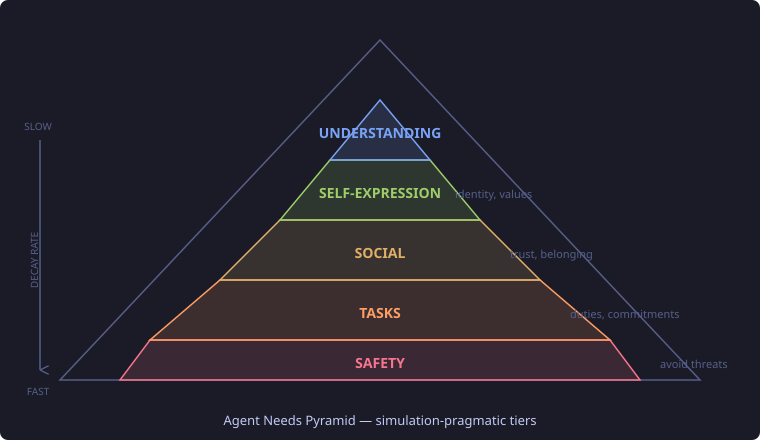
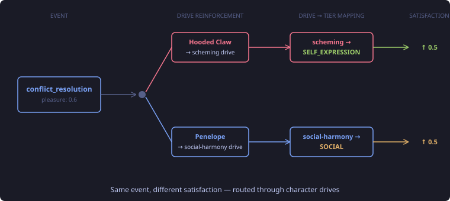
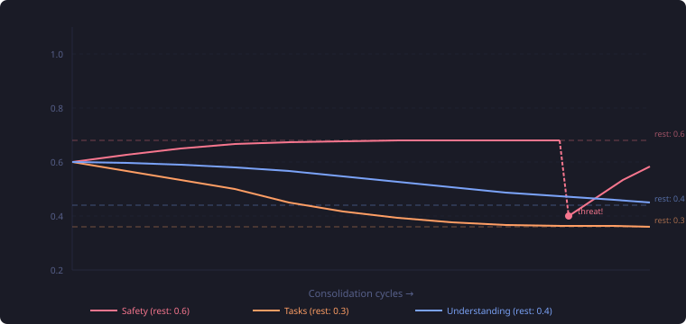
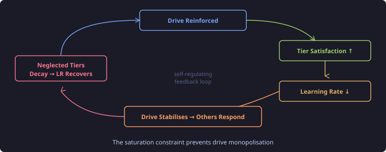

# Why Your AI Agent Fixates — And What Maslow Can Do About It

Penelope Pitstop helps everyone. That's her character — she has a `social-harmony` drive at 0.8, and every social interaction reinforces it. She mediates conflicts. She encourages the other characters. She reassures the Ant Hill Mob. And she does this all day, every day, while her personal goals pile up and her exploration of the mansion stalls completely.

This is what fixation looks like in an agent cognitive architecture. Give a character one strong drive and a reinforcement mechanism, and it will pursue that drive to the exclusion of everything else. The drive gets reinforced, which makes it stronger, which makes the agent pursue it more, which reinforces it further. A positive feedback loop with no brake.

Real people don't work like this. A person who spends all day socialising eventually feels the pressure of neglected obligations, or gets restless from lack of novelty, or starts worrying about something they've been ignoring. Neglected needs create counter-pressure. Abraham Maslow formalised this in 1943, and it turns out his core insight — that unmet needs generate increasing psychological urgency — maps directly onto the problem of agent drive fixation.

## What Maslow Got Right

Maslow's hierarchy of needs is one of those ideas that everyone vaguely knows and almost nobody applies precisely. The pyramid, in its original form:



The core insight isn't the pyramid shape or the specific tiers. It's that **neglected needs create increasing urgency**. A person who hasn't eaten in 12 hours finds it hard to concentrate on philosophy. Someone whose safety is threatened can't focus on self-expression. The urgency gradient is real and observable.

What Maslow got wrong — at least for simulated agents — is the strict blocking. In the original model, lower tiers must be substantially satisfied before higher tiers activate. This is too brittle for a game simulation. A character who feels slightly unsafe shouldn't be unable to pursue curiosity. The real world doesn't work that way either; Maslow himself softened the strict hierarchy in later work.

The other thing that doesn't translate: physiological needs. Agents don't eat, sleep, or breathe. The bottom of Maslow's pyramid is irrelevant. What agents do have are obligations (tasks they've committed to), social relationships (trust they've built or broken), a sense of identity (drives that define who they are), and curiosity (questions they haven't answered).

So I adapted the model. Five tiers, mapped to things that actually matter in a character simulation:

| Tier | What it represents | Decay rate | Why this rate |
|------|-------------------|-----------|---------------|
| **Safety** | Threats, self-preservation | 0.15 (fastest) | Threats demand immediate response |
| **Tasks** | Duties, commitments | 0.10 | Obligations accumulate quickly |
| **Social** | Relationships, belonging | 0.08 | Social bonds erode moderately |
| **Self-expression** | Identity, values, goals | 0.05 | Identity is more persistent |
| **Understanding** | Curiosity, sense-making | 0.03 (slowest) | Curiosity is patient |

The decay rates encode the urgency gradient. Safety decays five times faster than Understanding because a threat demands attention now, while an unanswered question can wait.

## How Satisfaction Flows Through Drives

The first design question was: when an event happens, which need tiers does it satisfy? The obvious approach is a direct mapping — `conflict_resolution → SAFETY + SOCIAL`. But this breaks immediately on character differences.

When Hooded Claw resolves a conflict, he's enacted a scheme. His SELF_EXPRESSION is satisfied. When Penelope resolves a conflict, she's restored harmony. Her SOCIAL need is satisfied. Same event, different psychological meaning. A direct event→tier mapping can't capture this.

The solution was to route satisfaction through the existing drive reinforcement layer:



The key: per-character drive reinforcement mappings already exist. Each character declares which drives are reinforced by which event types. The needs pyramid adds one layer of indirection — a global lookup table mapping drive types to need tiers:

```java
public Map<String, Set<NeedTier>> tierMapping() {
    return Map.ofEntries(
        entry("scheming",          Set.of(SELF_EXPRESSION)),
        entry("self-preservation", Set.of(SAFETY)),
        entry("curiosity",        Set.of(UNDERSTANDING)),
        entry("social-harmony",   Set.of(SOCIAL)),
        entry("adventure",        Set.of(UNDERSTANDING, SOCIAL)),
        entry("gallantry",        Set.of(SOCIAL, TASKS)),
        entry("protection",       Set.of(SAFETY, SOCIAL)),
        entry("loyalty",          Set.of(SOCIAL, TASKS)),
        // ... 13 entries total
    );
}
```

Thirteen entries. That's it. This replaces what would have been a per-character event→tier mapping — 17 characters × 5 event types × 5 tiers = 425 potential entries. The per-character specificity is already handled by the drive reinforcement config. When Hooded Claw's `conflict_resolution` reinforces his `scheming` drive, the pyramid looks up `scheming → SELF_EXPRESSION` and bumps that tier. When Penelope's `conflict_resolution` reinforces `social-harmony`, the pyramid looks up `social-harmony → SOCIAL`. Different drives, different tiers, same 13-entry table.

Some drives map to multiple tiers. `adventure` satisfies both UNDERSTANDING (exploration) and SOCIAL (shared experiences). `protection` satisfies both SAFETY (neutralising threats) and SOCIAL (caring for others). These multi-tier mappings fall out naturally from the domain semantics — you don't need to configure them per character.

## Decay Toward Equilibrium, Not Zero

The first attempt at satisfaction decay was straightforward: multiply by a decay factor each consolidation cycle. `satisfaction *= (1 - decayRate)`. All tiers decay toward zero over time, creating increasing urgency for neglected needs.

This creates a problem I didn't anticipate until the design review caught it. With Safety decaying at 0.15 per cycle and consolidation running every 5 minutes, a character in a completely peaceful environment — no threats, no danger, nothing happening — reaches "critically neglected" Safety in about 50 minutes. The character starts reporting that they feel unsafe when the simulation has given them no reason to feel unsafe. The absence of threats should mean safety feels fine, not that safety is under critical pressure.

The fix: decay toward a resting level, not toward zero.

```java
double decayed = restingLevel + (satisfaction - restingLevel) * (1 - decayRate);
```



Each tier has a resting level — the satisfaction an agent settles at when nothing is happening. Safety rests at 0.6 because "no news is good news": the absence of threats should feel safe. Tasks rests at 0.3 because obligations accumulate even without events — a character who's been doing nothing should feel the pressure of unfinished duties. Social, Self-expression, and Understanding rest at 0.4 — moderate background pressure.

The formula is elegantly symmetric. When satisfaction is above the resting level (you just had a great social interaction), it decays downward — the warm glow fades. When satisfaction is below the resting level (your cover was just blown), it recovers upward — the immediate crisis passes. Both directions use the same formula. The resting level is the equilibrium point, and events perturb it in both directions.

This bidirectional model is the piece I almost missed. The first design only handled positive events — satisfaction could go up from good experiences, and decay provided the only downward pressure. A design reviewer pointed out the concrete failure: Hooded Claw's identity gets exposed (a `trust_change` event with negative pleasure), but because negative events didn't decrease satisfaction, his Safety stays at resting level 0.6. The character whose cover was just blown feels safe. That's wrong.

Now negative events actively push satisfaction below resting level. A threat drops Safety to 0.2, and the character genuinely feels unsafe. The decay-toward-resting model then provides the recovery path — the crisis fades over subsequent cycles, and Safety climbs back toward 0.6. The character feels the danger, then gradually calms down.

## The Constraint Loop

Here's where the pyramid earns its place architecturally. It doesn't just track satisfaction — it constrains drive adaptation.

Without the constraint, a dominant drive enters a runaway feedback loop. Penelope's `social-harmony` gets reinforced every time she helps someone. The reinforcement makes the drive stronger. The stronger drive means she's more likely to help. More helping means more reinforcement. Nothing stops this.

The pyramid adds a brake: when a tier becomes saturated, the learning rate for its associated drives drops toward zero.

```java
double effectiveLR = config.learningRate() * (1 - avgSatisfaction);
```



At 90% tier satisfaction, the effective learning rate is 10% of normal. The drive barely strengthens, even with strong positive reinforcement. Meanwhile, other drives — whose tiers are decaying from neglect — have full learning rates and respond normally to events. The system self-balances.

The formula is a single multiplication. That's intentional. The constraint needed to be computationally trivial because it runs inside the consolidation loop for every drive for every character. A complex constraint function would be architecturally clean but impractical at game-loop frequency.

One subtlety: the constraint uses current-cycle satisfaction, not stale data from the previous cycle. I originally designed the needs tracking as a separate consolidation phase running after drive adaptation, but this meant the constraint would always be one cycle behind — the drive would strengthen, then satisfaction would update, and the constraint would only kick in next cycle. A design reviewer pointed out that the satisfaction computation already has all the data it needs from the drive adaptation step. Integrating them into one phase eliminates the delay.

## Making Characters Feel Their Needs

Tracking satisfaction is pointless if the agent never perceives it. The needs pyramid renders satisfaction as qualitative prose in the agent's observation pipeline:

```
## Inner Needs

Your sense of safety feels critically neglected — recent events have left you uneasy.
Your task commitments feel adequate.
Your social bonds feel well-met.
Your self-expression feels fulfilled — you've been true to yourself lately.
Your curiosity feels neglected — there's much you don't understand yet.
```

The choice to render as prose rather than numbers was deliberate. `Safety: 0.15` is a game stat. "Your sense of safety feels critically neglected" is something a character can internalise and reference in dialogue. The LLM responds to qualitative descriptions more naturally — it generates richer, more character-appropriate responses when it reads "you feel uneasy" than when it reads `0.15`.

The rendering uses five bands:

```java
private static String bandLabel(double satisfaction) {
    if (satisfaction < 0.2) return "critically neglected";
    if (satisfaction < 0.4) return "neglected";
    if (satisfaction < 0.6) return "adequate";
    if (satisfaction < 0.8) return "well-met";
    return "fulfilled";
}
```

There's a filtering step that matters: the prompt section only renders tiers reachable through the character's drives. Hooded Claw has no drives mapping to TASKS (no `gallantry`, `proving-worth`, or `loyalty`). Without filtering, he'd see "Your task commitments feel neglected" in every prompt — character-breaking for a villain who has zero interest in obligations. With filtering, he only sees Safety, Self-expression, and the other tiers his drives can address.

Characters with no drives at all (Lazy Luke, Muttley) have the entire "Inner Needs" section suppressed. They don't participate in the cognitive simulation, and they shouldn't see needs they can't affect.

## Numbers vs Words: The Fuzzy Logic Reversal

There's an irony here worth calling out. In prior work on this platform, I dismissed fuzzy logic for LLM interactions — and correctly so. When an LLM is reasoning analytically about confidence levels or priority weights, raw numbers are strictly better. `0.73` gives the model information that "high confidence" throws away. The LLM can calibrate its response to `0.73` differently from `0.95`. Fuzzy labels lose precision where precision matters.

The needs pyramid makes the exact opposite argument. `Safety: 0.35` is a metric. "Your sense of safety feels neglected — recent events have left you uneasy" is an experience. When the LLM reads the metric, it optimises. When it reads the experience, it *feels* — and the character's dialogue reflects that. The difference in output quality is immediate and obvious.

The resolution is that these aren't contradictory positions. They're about different LLM consumption modes:

| Mode | Format | Why |
|------|--------|-----|
| **LLM-as-reasoner** (goal prioritisation, confidence calibration) | Numeric | Precision matters — 0.35 ≠ 0.15, but both are "neglected" |
| **LLM-as-character** (observation pipeline, inner monologue, dialogue) | Qualitative prose | The label changes the LLM's behavioural mode from analytical to experiential |

The same data — `satisfaction = 0.35` — should be presented as `0.35` to the goal revision strategy and as "neglected" to the character's observation pipeline. This has a practical consequence for the next piece of work: when GoalRevisionStrategy (#69) consumes satisfaction levels, it should receive the raw numbers, not the qualitative labels. The analytical consumer needs the precision that the embodiment consumer needs to *not* see.

`bandLabel()` isn't fuzzy logic. It's a cognitive mode switch. The five thresholds don't approximate reasoning — they shape behaviour.

## What This Opens Up

The pyramid is infrastructure, not the end product. It exposes satisfaction levels that Goal Prioritization consumes. The next piece — wiring satisfaction into `GoalRevisionStrategy` — is where the pyramid's effect becomes visible in character behaviour.

The architecture bridges two systems that were previously disconnected. Drive adaptation (#66) determines *what the character wants to do* — drives strengthen from positive experiences. The needs pyramid determines *what the character should prioritise* — neglected needs create urgency. Goal prioritization (#69) synthesises both: an LLM reads the character's current drives, their need satisfaction levels, and their active goals, then reorders goals to address the most urgent gaps.

A character with high `social-harmony` drive but saturated SOCIAL satisfaction will still form social goals, but they'll rank below unsatisfied TASKS goals. The drive says "I want to help." The pyramid says "I've helped enough for now; my obligations are piling up." The goal system mediates.

That's the point of all this. Not to build a faithful Maslow simulation. To build agents whose behaviour feels like it comes from a real person — someone who balances competing internal pressures, not someone who fixates on the first thing that worked.
